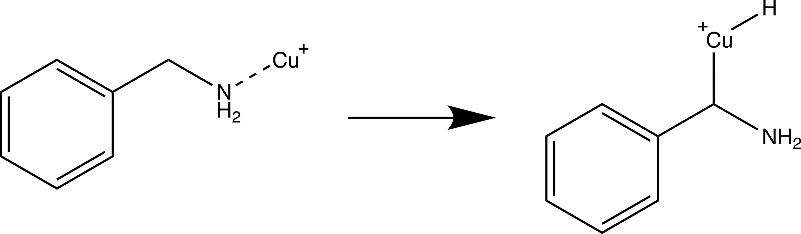

# Locating the Transition State using an NEB calculation (Step 2B)

This page describes the procedure for locating the transition state using the Nudge Elastic Band (NEB) calculation. 

Running NEB's of molecules is not complicated, however care needs to be taken when obtaining the initial and final images. This is because you want an NEB calculation to focus on how atoms move about in the active region where changes in your molecule is occurring. Ideally, you want all the other atoms that do not contribute to the reaction to remain in place as best as possible. 

In this article, we will looks at the ideal way to set up and run an NEB calculation for molecules. 

**NOTE**: This article is a sub-article of https://github.com/geoffreyweal/ORCA_Mechanism_Procedure. The ``viewNEB`` program used in this procedure can be obtained during installation (the [Before You Begin](https://github.com/geoffreyweal/ORCA_Mechanism_Procedure?tab=readme-ov-file#before-you-begin) section) for the ORCA mechanism procedure.


## What to do if I have problems:

Check out the [troubleshooting section here](https://github.com/geoffreyweal/ORCA_Mechanism_Procedure?tab=readme-ov-file#troubleshooting) if you have problems when running through this proceedure.


## Questions and Feedback

I am very keen for feedback about how you find the information in this github page, both the process and the clarity of what I have written. If you have any questions about this process, feed free to write me a message. 

To do this, click on the ``Issues`` tag at the top of this Github page, click the ``New issue`` button, and write you question/give you feedback. 

Thanks!


## ORCA

I have written this procedure for: 

* ORCA 5.0.3
* ORCA 5.0.4

This method should be valid for future versions of ORCA, but just in case any problems occur it may be due to ORCA version issues. 


## Before beginning

Read the **Before beginning** section of https://github.com/geoffreyweal/ORCA_Mechanism_Procedure

## Mechanistic Step Example

The mechaistic step we will be used to help describe the process is shown below:

<p align="center">
    
</p>

Here, we want to determine the transition state for a Cu inserting itself into the C-H bond of the alpha bond in benzylamine. 

# Before Beginning the Nudge Elastic Band (NEB) calculation

Before beginning the NEB calculation, look at https://github.com/geoffreyweal/ORCA_Mechanism_Procedure to perform the Pre-calculation step and Step 1. 

## Pre-calculation step:

Before beginning, you need to decide what universal setting you want to use for your mecahnisms. This includes the basis set, functional, solvent model, etc. For example: 

```
!B3LYP DEF2-TZVP D3BJ
%CPCM EPSILON 6.02 REFRAC 1.3723 END
```

Other options that are good to include in all your orca input files are:

```
%SCF
    MaxIter 2000       # Here setting MaxIter to a very high number. Intended for systems that require sometimes 1000 iterations before converging (very rare).
    DIISMaxEq 5        # Default value is 5. A value of 15-40 necessary for difficult systems.
    directresetfreq 15 # Default value is 15. A value of 1 (very expensive) is sometimes required. A value between 1 and 15 may be more cost-effective.
END
%PAL NPROCS 32 END # The number of CPUs you want ORCA to use
%maxcore 2000 # This indicates you want ORCA to use only 2GB per core maximum, so ORCA will use only 2GB*32=64GB of memory in total.
```

**RECOMMENDATIONS**: With regards to the functional, basis set, solvent model, etc., it is recommended that you discuss what you are wanting to do with a computational chemist (if you are not a computational chemist) to get advice about how to set up these, as well as how to proceed with your project. This is important because you want to keep these as consistent as possible across all your mechanistic steps you perform. I would personally recommend reading other computation papers related to the system you are looking at understanding, as well as reading the following papers to understand what functional and basis set is most appropriate for your project:
* https://onlinelibrary.wiley.com/doi/epdf/10.1002/anie.202205735 (This paper is VERY recommended to non-computational chemists and computational chemist. It is a very good guide at all the considerations you should make and best Practices)
* https://pubs.rsc.org/en/content/articlelanding/2017/cp/c7cp04913g (The results section (particularly the end of the results section) provides a list of good functionals to use based on scientific validations)
* https://bpb-ap-se2.wpmucdn.com/blogs.unimelb.edu.au/dist/0/196/files/2021/05/GOERIGK_GroundStateDFT_RACI2021_handout.pdf (Slides from Larz Goerik based on the paper above)
* https://www.publish.csiro.au/CH/CH20093 (This paper give an idea of what you need to think about for excited state calculations)


## Step 1: Locally optimize reactant and product

Read [Step 1: Locally optimize reactant and product](https://github.com/geoffreyweal/ORCA_Mechanism_Procedure?tab=readme-ov-file#step-1-locally-optimize-reactant-and-product) to see how to perform Step 1.


# Step 2B: Performing an Nudge Elastic Band (NEB) Calculation

We will now perform the procedure to perform an NEB calculation on molecules in ORCA. We will 

* Present the example that we will use to describe the steps to this procedure
* Indicate what settings you would include in all your ``inp`` files for this procedure
* Present the steps for performing the machanistic investigation procedure

## Step 2B.1: Choose an Optimised Structure and Modify it

To begin, it is a good idea to take either the optimised ``Reactant`` or ``Product`` structure from [step 1](https://github.com/geoffreyweal/ORCA_Mechanism_Procedure?tab=readme-ov-file#step-1-locally-optimize-reactant-and-product) and use this as your focus structure. You then move the relevant atoms in the structure of the ``Reactant`` (``Product``) so that it resembles the ``Product`` (``Reactant``) somewhat. 
* The reason for doing this is to make sure any atoms not involved directly in the mechanism are ordered correctly for NEB calculations, and to try to keep these atoms in the same position as best as possible. This will be clearer as we proceed with step 2B. 

In this example, I have chosen the ``Product`` structure to focus on. I then moved atom 17 (Cu) to the other side of the N atom (atom 12), and moved atom 14 (H) down so that it was close to the C atom (atom 11). 


## Step 2B.2: Optimise Reactant from Product (or Product from Reactant) with constraints

Next, we will perform a geometric optimisation calculation on this modified structure. However, we dont want the atoms that are not involved in the mechanism to move. This will help when we are comparing the optimised reactant and product later on in this process. 

In this example, we will optimise the newly created reactant structure. The orca input file looks as follows:

```orca.inp
!B3LYP DEF2-TZVP D3BJ 
!OPT FREQ TightOPT TightSCF defgrid2
%SCF
    MaxIter 2000       # Here setting MaxIter to a very high number. Intended for systems that require sometimes 1000 iterations before converging (very rare).
    DIISMaxEq 5        # Default value is 5. A value of 15-40 necessary for difficult systems.
    directresetfreq 15 # Default value is 15. A value of 1 (very expensive) is sometimes required. A value between 1 and 15 may be more cost-effective.
END
%CPCM EPSILON 6.02 REFRAC 1.3723 END
%PAL NPROCS 32 END
%maxcore 2000 # This indicates you want ORCA to use only 2GB per core maximum, so ORCA will use only 2GB*32=64GB of memory in total.
%GEOM
    Constraints
        {C 0 C}
        {C 1 C}
        {C 2 C}
        {C 3 C}
        {C 4 C}
        {C 5 C}
    END
END
* xyzfile 1 1 reactant.xyz 
```

Here, we have chosen to constrain the atoms in the benzene moiety from moving. The optimisation process is shown below:


By constraining the benzyl atom in benzylamine, we have allowed the Cu atom to optimise to an ideal position while keeping the benzyl moiety in the same place. 

### What to do if you have problems:


## Step 2B.3: Optimise Reactant from Product (or Product from Reactant) without constraints

Now that we have optimised the constrained reactant, we will not repeat the optimisation process above, but without the constraints. The ORCA input file here as the same as in Step 2B.2, excluding the ``Constraints`` component:

```orca.inp
!B3LYP DEF2-TZVP D3BJ 
!OPT FREQ TightOPT TightSCF defgrid2
%SCF
    MaxIter 2000       # Here setting MaxIter to a very high number. Intended for systems that require sometimes 1000 iterations before converging (very rare).
    DIISMaxEq 5        # Default value is 5. A value of 15-40 necessary for difficult systems.
    directresetfreq 15 # Default value is 15. A value of 1 (very expensive) is sometimes required. A value between 1 and 15 may be more cost-effective.
END
%CPCM EPSILON 6.02 REFRAC 1.3723 END
%PAL NPROCS 32 END
%maxcore 2000 # This indicates you want ORCA to use only 2GB per core maximum, so ORCA will use only 2GB*32=64GB of memory in total.
* xyzfile 1 1 reactant_opt_constrained.xyz 
```

In this example, the unconstrained optimisation calculation does not change the molecule much, which is what we ideally want. 


## Step 2B.4: Perform the Climbing Image - Nudge Elastic Band (CI-NEB) calculation

In an NEB, we trace a path from the reactant to the product. An optimization is performed across all the images at the same time in order to try to find the transition step.

In the ``.inp`` file, you want to include the following:

```
!NEB-CI TightSCF defgrid2
```

 The tags here indicate you want to do the following: 

* ``NEB-CI``: This keyword will perform a nudged-elastic band (NEB) calculation upon your system using the climbing image varient of the NEB algorithm. 
* ``TightSCF``: Tells ORCA to tighten the convergence criteria for each electronic step. 
* ``defgrid2``: Indicates how fine we want the intergration grid to be (This is the default).

We also include the following NEB settings: 

```
%NEB
    NEB_END_XYZFILE "product_opt.xyz"
    Nimages 100
    Interpolation IDPP
    Opt_Method LBFGS
END
* XYZfile 1 1 reactant_opt_unconstrained.xyz
```

 The tags here indicate you want to do the following in your NEB calculation: 
* ``NEB_END_XYZFILE``: This is the reactant structure you want to use. Include this file in the same place as your ORCA ``.inp`` file.
* ``Nimages``: These are the number of images you want to include in the NEB calculation (not including the reactant and product image). In this example, we we will create 102 images from ``reactant_opt_unconstrained.xyz`` to ``opt_product.xyz`` (100 images in between but not including ``reactant_opt_unconstrained.xyz`` to ``opt_product.xyz``)
* ``Interpolation``: This is the interpolation scheme first used to create all the initial images. We will talk about this later. 
* ``Opt_Method``: This is the optimisation method used. 

**IMPORTANT:** It is important that the atom ordering in your reactant and product ``xyz`` files are the same, otherwise you will problems where atoms seems to move about in nosense ways. 

**NOTE 1**: In this example I have set ``Nimages`` to 100. I chose this to allow for some smoothness between images in the mechanistic step. However, you could set this to much less and everything would probably work. For example, 20 would probably also work fine. Try not to use too many images, as this can cause problems and also increases the amount of time required for the NEB to converge. 

**NOTE 2**: I use ``LBFGS`` in this example as the optimisation method. This is a very good algorithm, but it can be a bit loose and cause issues. In testing I tried the ``FIRE`` method, This worked also, but causes jitters which can lead to problems. The point is if you have convergence problems, try using another method for ``Opt_Method``. See the ORCA manual 5.0.4: Page 784 for options for this setting. 

In this example, we are looking at how a Cu atom could insert itself into a C-H bond. The full ``orca.inp`` file is given below found in ``Examples/Step2B_4_Run_NEB_Calculation/orca.inp``): 

```
!B3LYP DEF2-TZVP D3BJ
!NEB-CI TightSCF defgrid2
%SCF
    MaxIter 2000       # Here setting MaxIter to a very high number. Intended for systems that require sometimes 1000 iterations before converging (very rare).
    DIISMaxEq 5        # Default value is 5. A value of 15-40 necessary for difficult systems.
    directresetfreq 15 # Default value is 15. A value of 1 (very expensive) is sometimes required. A value between 1 and 15 may be more cost-effective.
END
%CPCM EPSILON 6.02 REFRAC 1.3723 END
%PAL NPROCS 32 END
%maxcore 2000 # This indicates you want ORCA to use only 2GB per core maximum, so ORCA will use only 2GB*32=64GB of memory in total.
%NEB
    NEB_END_XYZFILE "product_opt.xyz"
    Nimages 100
    Interpolation IDPP
    Opt_Method LBFGS
END
* XYZfile 1 1 reactant_opt_unconstrained.xyz

```

### Consideration before Running your NEB Calculation

Before submitting your NEB calculation to slurm for calculation, it is a good idea to make sure that the atom ordering in your reactant and product xyz files are correct. To do this, the best idea is to flicker between the two xyz file in ASE GUI:

```bash
# change directory into the folder containing your NEB calculation
cd Examples/Step2B_4_Run_NEB_Calculation

# View the reactant and product for the NEB calculation using ASE
ase gui reactant_opt_unconstrained.xyz product_opt.xyz
```

Next, in the ASE GUI click ``View`` -> ``Show Labels`` -> ``Atom Index``. This will display the indices of the atoms in your reactant and product structures. 

 

In the example above, we see that the atom indices for each atom in the reactant and product allign with each other, such that there should be a natural way to get from reactants to products. 

### Outputs from ORCA

ORCA will create a number of files as well as the ``output.out`` file. These are the imporant ones to looks at for NEB calculations: 

* ``orca_initial_path_trj.xyz``: THis is the initial NEB path that you want to investigate. **IMPORTANT: Make sure you check this file once your calculation is running to make sure that ORCA is indeed performing the mechanism that you want to investigate.**
* ``orca_MEP_trj.xyz``: This is the NEB trajectory for the mechanism.
* ``orca_NEB-TS_converged.xyz``: This is the transition state that was obtained from this NEB calculation. 

#### Check the ``orca_initial_path_trj.xyz`` file

When your NEB calculation first begins, as interpolation scheme will create the initial images connecting the reactant and the product. ORCA will create a file called ``orca_initial_path_trj.xyz``. This file gives an idea of the initial NEB path that ORCA will begin investigating. It is a **very very good idea** to check this file in ASE GUI and see that the mechanistic pathway look sensible. 

```bash
# change directory into the folder containing your NEB calculation
cd Examples/Step2B_4_Run_NEB_Calculation

# View the reactant and product for the NEB calculation using ASE
ase gui orca_initial_path_trj.xyz
```

For this example, this file looks like this:


In this example, atom 14 (H) floats away in free space from atom 11 (C), and there is a bit of time before atom 14 bonds to atom 17 (Cu). This indicates there may be a problem and the NEB might have trouble. However, NEB calculations are designed to change the mechanistic path to account for this and found a more likely mechanistric pathway, so this is not a horrible initial NEB pathway. 

The general rule is: The simplier you can make the initial NEB pathway, the more likely the NEB calculation will converge. 

#### Check the NEB daily

NEB calculations, like any ORCA calculation, have the potential to go in weird directions that makes convergence unlikely. This is particularly the case for NEB calculations. For this reason, it is important to check the ``orca_MEP_trj.xyz`` file and see if it is giving a somewhat sensible pathway while it is running just to make sure ORCA has not gone off the rails. Also check the end of the ``output.log`` file to see how your NEB calculation is running. 


#### Outputs from NEB calculation

Once ORCA has finished performing the NEB calculation, we will want to visualise the NEB. You can visualize how ORCA has performed the mechanistic step by typing ``viewNEB`` into the terminal. 

```bash
# cd into your optimisation folder
cd ORCA_Mechanism_Procedure/Examples/Step2_Find_TS/NEB

# View the NEB calculation 
viewNEB
```

You will get a GUI that shows you the following NEB pathway:


The energy profile for this example is given below:


You can see that a transition state is given by ORCA as the ``orca_NEB-CI_converged.xyz`` file. This is what the given transition state looks like in this example:


## Step 3 Onwards

We can not perform Step 3 of the ORCA Mechanism Procedure upon the ``orca_NEB-CI_converged.xyz`` file. 
* [Click here](https://github.com/geoffreyweal/ORCA_Mechanism_Procedure?tab=readme-ov-file#step-3-optimise-the-transition-state) to read more about performing Step 3 onwards for the ORCA Mechanism Procedure. 


## Other comments about NEBs

### Comments about the ``Opt_Method`` settings

The ``LBFGS`` is a common optimisation algorithm used in geometric optimisations. The note from ORCA is that *The L-BFGS is more aggressive and efficient, but also more error-prone.* Because of this, it is a common strategy to change the optimisation algorithm used to help the NEB calculation. In testing this proceedure I also used the ``FIRE`` which is also a good algorithm. However in this case, the ``FIRE`` algorithm was less able to scout the NEB. Here is the NEB for the same NEB calculation shown above using the ``FIRE`` method.

This is the NEB path that I got from the NEB calculation using the ``FIRE`` algorithm: 


The energy profile for this example is given below:


You can see from the NEB path and the energy profile that its a bit jittery, but overall the NEB did work as we found a good transition state:


At the end of the day, it doesnt matter how "well" the NEB calculation did, it only depends if we find a sufficient transition state that we can further optimise in [Step 3: Optimise the Transition State](https://github.com/geoffreyweal/ORCA_Mechanism_Procedure?tab=readme-ov-file#step-3-optimise-the-transition-state). So I would say I would be happy with how this NEB ran, and would have continued to Step 3 of the [ORCA Mechanism Procedure](https://github.com/geoffreyweal/ORCA_Mechanism_Procedure). 


# Troubleshooting the Nudged Elastic Band (``NEB``) Calculation

Some troubleshooting comments that I and others have experience during this procedure are given below.

Also look at the following websites for help:

* https://github.com/geoffreyweal/ORCA_Mechanism_Procedure?tab=readme-ov-file#troubleshooting
* https://sites.google.com/site/orcainputlibrary/scf-convergence-issues (apart of https://sites.google.com/site/orcainputlibrary)


# Other Information about performing NEBs in ORCA

The following links have good information for performing NEBs in ORCA:

* https://www.orcasoftware.de/tutorials_orca/react/nebts.html: Nice article from the developers about how to perform an NEB in ORCA
* https://sites.google.com/site/orcainputlibrary/geometry-optimizations/tutorial-neb-calculations: Nice extra information for performing and analysising NEBs
* https://github.com/via9a/neb_visualize: Contain another program for analysing how the NEB optimised. This program is really good for figuring out how the NEB optimised itself, very helpful!


